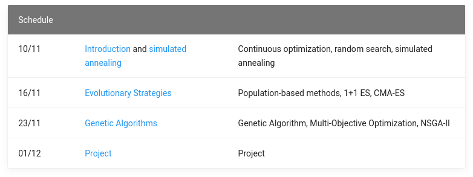

## Introduction to Stochastic Optimization

Random Search, Simulated Annealing, Evolutionary Strategies, Genetic Algorithms

**ISAE-SUPAERO, SD, November 2020**

Dennis WILSON

<!--s-->

### Stochastic Optimization

+ Search methods which use random variables to optimize on an objective function
+ No requirements for the objective function: not differentiable, convex, concave, simple. Any function works.
+ This is not problems which are stochastic (stochastic programming)
+ Other names: metaheuristics, black-box optimization, stochastic search
+ Examples: simulated annealing, particle swarm optimization, evolutionary strategies, genetic algorithms

<!--s-->
### Search: the Traveling Salesman example

Given a list of cities and the distances between each pair of cities, what is
the shortest possible route that visits each city once and returns to the
origin city?

Representation: list of cities in order

Objective function: total distance traveled

<!--s-->

### Search: Continuous Optimization

Representation: coordinates in N dimensional space

Objective function: problem-specific

<!--s-->

### Application: wind farm layout optimization

Representation: x,y coordinates of wind turbines

Objective function: Expected energy gain

Stochastic search methods are state-of-the-art because resolution methods based
on constraint satisfaction or planning are too costly given the physical
simulation of wind turbine wakes.

<!--s-->

### Application: Software development

Representation: Computer program (grammar or abstract syntax tree)

Objective function: Runtime, number of tests passed

<!--s-->

### Pros and Cons

Pros
  + Flexibility in problem representation
  + Flexibility in objective function
  + Multitude of proven algorithms with (comparatively) few hyperparameters
  + Relatively easy to understand

Cons
  + Computational cost
  + Search not fully informed by objective function
  + Expert knowledge for representation or objective function design

<!--s-->

### Class format

+ Course website at https://SupaeroDataScience.github.io/stochastic/
+ Notebooks available on course website or at https://github.com/SupaeroDataScience/stochastic/
+ Fully distance based:
  + Presentations on Zoom
  + Group work on Slack
  + Same groups for 4/11, 10/11, 17/11
+ Evaluation by project, different groups of 3, on 25/11

<!--s-->

### Class schedule

